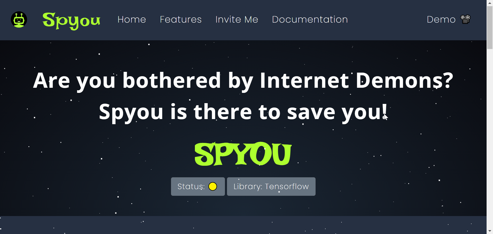

# Spyou-Slack

### Project Description

There is an increase in violation of community guidelines due to increased usage of hate speech, scurrility, and NSFW content. Such comments are difficult to spot, filter, and control manually, and not taking quick action would also defeat the goal of a harmonious and unified community.
This Discord bot helps filter out these messages, deletes them and issues a warning to the user.

``` Only owners of the Slack bot(App) can run the code with the necessary operations```
### Technologies Used:
- Tensorflow's Toxicity API
- Bolt.js
- Node.js
- Heroku(Deployment)

[](https://www.youtube.com/watch?v=c0Yuqi6f2U0)
